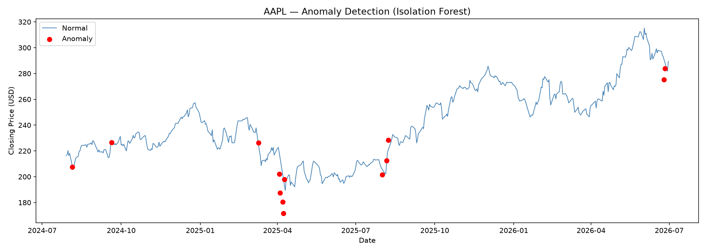

# Real-Time Stock Anomaly Detection Pipeline

A production-style, end-to-end ML pipeline that streams live stock prices,
processes them with Apache Spark, detects anomalies using Isolation Forest,
and visualizes results in a live Streamlit dashboard — fully automated with Apache Airflow.



---

## Architecture
Yahoo Finance API
│
▼
┌─────────────────┐
│   Apache Kafka  │  ← Real-time message streaming (Docker)
│  (producer.py)  │
└────────┬────────┘
│
▼
┌─────────────────┐
│  Apache Spark   │  ← Structured streaming, rolling avg + volatility
│ (spark_consumer)│
└────────┬────────┘
│
▼
┌─────────────────┐
│ Isolation Forest│  ← Anomaly detection model (scikit-learn)
│  (train_model)  │
└────────┬────────┘
│
▼
┌─────────────────┐
│   Flask API     │  ← REST prediction endpoint (/invocations)
│ (serve_model)   │    SageMaker-compatible interface
└────────┬────────┘
│
▼
┌─────────────────┐
│ Apache Airflow  │  ← Hourly pipeline orchestration (Docker)
│  (DAG: 4 tasks) │
└────────┬────────┘
│
▼
┌─────────────────┐
│    Streamlit    │  ← Live anomaly visualization dashboard
│  (dashboard.py) │
└─────────────────┘

---

## Tech Stack

| Layer | Technology | Purpose |
|---|---|---|
| Data Streaming | Apache Kafka + Docker | Real-time stock price ingestion |
| Stream Processing | Apache Spark (PySpark) | Rolling averages, volatility features |
| ML Model | Isolation Forest (scikit-learn) | Unsupervised anomaly detection |
| Model Serving | Flask REST API | SageMaker-compatible prediction endpoint |
| Cloud Deployment | AWS SageMaker (script ready) | Production model hosting |
| Orchestration | Apache Airflow + Docker | Hourly automated pipeline |
| Dashboard | Streamlit + Plotly | Live anomaly visualization |
| Version Control | Git + GitHub | Code management |

---

## What it does

1. **Streams** live OHLCV data for AAPL, GOOGL, MSFT from Yahoo Finance into a Kafka topic every 60 seconds
2. **Processes** the stream with Spark Structured Streaming — computing 5-minute rolling averages and volatility (standard deviation)
3. **Detects** anomalies using an Isolation Forest model trained on 2 years of historical data (1,446 data points, 5 engineered features)
4. **Serves** predictions via a Flask REST API matching AWS SageMaker's `/invocations` endpoint convention
5. **Automates** the full pipeline (fetch → features → predict → save) hourly via an Airflow DAG
6. **Visualizes** results in a live Streamlit dashboard with interactive Plotly charts

---

## Results

The model flagged **73 anomalies** out of 1,446 historical data points (5.0%), correctly identifying:
- The April 2025 AAPL selloff during tariff/trade fears
- Unusual volume spikes at key price reversals
- Sharp multi-day price deviations from rolling averages

---

## Project Structure
stock-anomaly-pipeline/
│
├── producer.py              # Kafka producer — streams live stock data
├── consumer.py              # Simple Kafka consumer (Week 1 verification)
├── spark_consumer.py        # PySpark structured streaming consumer
├── train_model.py           # Isolation Forest training + feature engineering
├── serve_model.py           # Flask REST API for model inference
├── deploy_sagemaker.py      # AWS SageMaker deployment script
├── dashboard.py             # Streamlit live dashboard
│
├── dags/
│   └── stock_pipeline_dag.py  # Airflow DAG (4-task pipeline automation)
│
├── model/
│   └── aapl_anomalies.png   # Anomaly visualization (training data)
│
├── docker-compose.yml           # Kafka + Zookeeper containers
├── docker-compose-airflow.yml   # Airflow + PostgreSQL containers
└── README.md

---

## How to Run

### Prerequisites
- Docker Desktop
- Python 3.12+
- AWS account (for SageMaker deployment only)

### 1. Start Kafka
```bash
docker-compose up -d
```

### 2. Stream live data
```bash
# Terminal 1
python producer.py

# Terminal 2
python consumer.py
```

### 3. Process with Spark
```bash
python spark_consumer.py
```

### 4. Train the model
```bash
python train_model.py
```

### 5. Serve predictions
```bash
python serve_model.py
# API available at http://localhost:8080/invocations
```

### 6. Start Airflow
```bash
docker-compose -f docker-compose-airflow.yml up -d
# UI at http://localhost:8081 (admin/[see .env])
```

### 7. Launch dashboard
```bash
streamlit run dashboard.py
# Dashboard at http://localhost:8501
```

---

## API Usage

```bash
curl -X POST http://localhost:8080/invocations \
  -H "Content-Type: application/json" \
  -d '{"instances": [[281.2, 281.2, 0.0, 0.001, 0.5]]}'
```

Response:
```json
{
  "predictions": [{"instance": 0, "prediction": "normal", "anomaly_score": -0.44}],
  "total_instances": 1,
  "anomalies_detected": 0
}
```

---

## Built in response to

This project was built specifically to address feedback from a data science internship rejection citing lack of experience with:
 ✅ Real-time, end-to-end production pipelines
 ✅ Apache Kafka for scalable data streaming
 ✅ Apache Spark for distributed data processing
 ✅ Cloud-based model deployment (AWS SageMaker)
